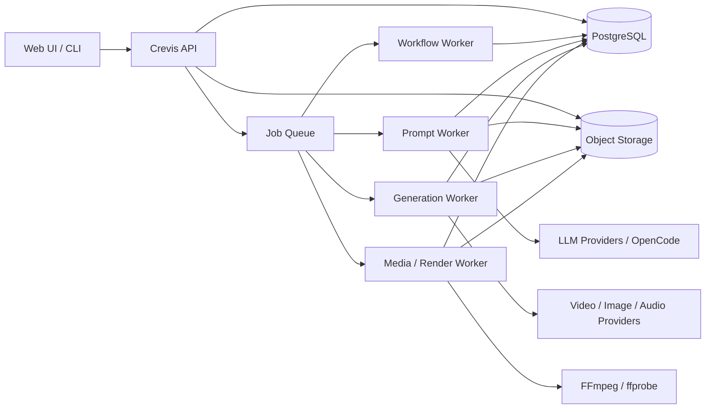
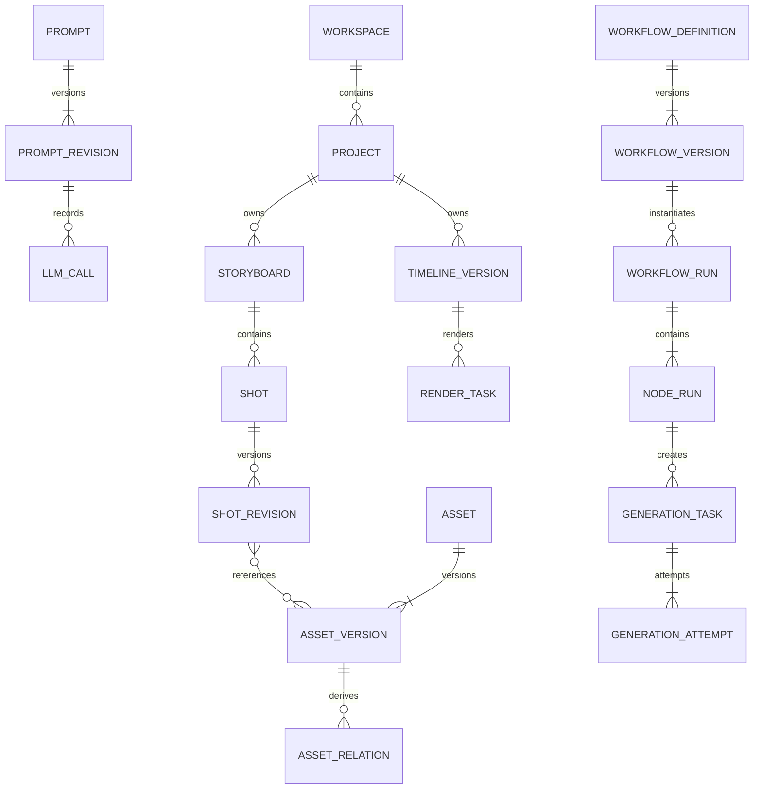
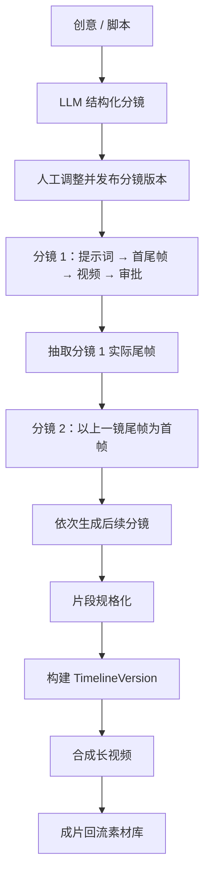

# Crevis 项目架构规格说明

> 状态：Draft for implementation
>
> 版本：v1.1（模块化拆分）
>
> 更新日期：2026-07-05
>
> 依据：`specs/framework/spec.md`、`specs/workflow-v1/spec.md`、当前 Python 实现及业界公开方案

## 1. 文档目的

本文是 Crevis 目标架构的主文档，描述整体目标、系统边界、关键决策、模块关系、端到端流程和实施方向。各模块的领域模型、接口、执行规则和验收标准写在独立文档中。

Crevis 将从“单次视频生成 CLI”演进为“可持续生产长视频的 AI 视频工作台”：统一管理图片、视频、声音、人物和场景素材，记录提示词与模型任务，通过可恢复工作流连续生成分镜短视频，再以版本化时间线合成长视频。

## 2. 文档导航

| 模块 | 内容 |
|---|---|
| [素材管理](architecture/01-asset-management.md) | Asset/AssetVersion、人物/声音/场景库、上传、对象存储和素材谱系 |
| [项目与分镜](architecture/02-project-storyboard.md) | Project、Storyboard、Shot、关键帧、候选审批和镜间连续性 |
| [提示词与模型网关](architecture/03-prompt-model-gateway.md) | Prompt 版本、LLM 优化、OpenCode、供应商适配和能力矩阵 |
| [工作流编排](architecture/04-workflow-orchestration.md) | 版本化 DAG、节点契约、运行状态、调度和人工交互 |
| [任务与可靠性](architecture/05-task-reliability.md) | Task/Attempt、幂等、Outbox、租约、重试、webhook 和 reconciliation |
| [媒体处理与合成](architecture/06-media-rendering.md) | ffprobe/FFmpeg、规格化、Timeline、音轨、字幕和长视频导出 |
| [API 与前端](architecture/07-api-frontend.md) | REST/SSE、资源接口、CLI 统一和前端信息架构 |
| [安全与可观测性](architecture/08-security-observability.md) | 权限、密钥、文件安全、审计、指标、告警和成本 |
| [实施路线与测试](architecture/09-implementation-roadmap.md) | 包结构、迁移阶段、数据迁移、测试和发布门禁 |

拆分前完整文档保存在 [归档快照](architecture/archive-monolith-v1.md)，只用于核对，不再作为实施基线。

## 3. 目标与非目标

### 3.1 目标

1. 素材统一入库：支持上传、远程导入、生成结果回流和派生版本，并按人物、声音、场景、道具和项目复用。
2. 全链路留痕：记录原始提示词、优化过程、模型参数、供应商任务、输入输出、人工修改、费用和错误。
3. 模型解耦：大语言模型、图像、视频和音频能力通过适配器接入；Seedance 2.0 是首个视频供应商，不进入领域模型。
4. 工作流可恢复：服务或 Worker 重启后继续执行，节点支持超时、重试、取消、人工确认和从失败处续跑。
5. 分镜连续生成：每镜确定首尾帧，相邻镜默认以上一镜实际尾帧作为下一镜首帧。
6. 长视频合成：短视频规格化后按版本化时间线拼接，支持转场、字幕、旁白、音乐和多版本导出。
7. 渐进式落地：复用 `workflow-v1` 的提交、轮询和下载经验，避免当前阶段过度微服务化。

### 3.2 非目标

1. 第一阶段不建设通用低代码平台，只实现 Crevis 受控节点集合和 DAG 编辑。
2. 第一阶段不训练或托管基础生成模型，只调用外部 API 或本地适配器。
3. 第一阶段不实现专业 NLE 的全部能力，时间线聚焦分镜顺序、转场、字幕、音频和导出。
4. 不承诺生成模型绝对人物一致性；系统通过固定资产、帧依赖、结构化约束、检查和重生成降低漂移。

## 4. 当前基础与主要差距

仓库现有两条链路：

- `video_generator.py + config_loader.py`：YAML、浏览器预览和后台线程的旧链路；
- `main.py + workflow-v1 模块`：CLI 输入、提交、轮询、下载和 JSONL 历史链路。

`workflow-v1` 已有最小闭环：

```text
收集输入 → 生成版本 → 远程化 → 构建请求 → 提交任务
       → 持久化 → 轮询 → 下载结果
```

目标架构必须解决以下差距：

| 现状 | 风险 | 目标 |
|---|---|---|
| `RemoteUploader` 只拼接 URL | 供应商无法访问本地文件 | 真实对象存储上传 |
| URL 被转为 `Path` | `https://` 识别损坏 | URL 与本地路径使用不同类型 |
| 秒级版本号、内存防重 | 并发冲突、重启失效 | UUIDv7/ULID + 数据库幂等 |
| JSONL 整文件更新 | 并发和查询能力不足 | PostgreSQL 当前态 + 事件历史 |
| CLI 守护线程监听 | 进程退出即停止 | 独立持久化 Worker |
| 直接依赖 Ark SDK | 无法切换模型 | Provider Adapter |
| 任务只表达单次生成 | 无法描述长视频生产 | Project、Shot、Run、NodeRun、Task、Timeline |
| 只保存最终提示词 | 无法复盘优化 | PromptRevision 与 LLMCall |
| 两套入口并存 | 配置和状态语义分裂 | Web/CLI 共用 application service |

详细迁移见[实施路线](architecture/09-implementation-roadmap.md)。

## 5. 业界模式与取舍

| 方案 | 可借鉴模式 | Crevis 取舍 |
|---|---|---|
| ComfyUI | 节点图工作流和独立 JSON 版本化。[官方文档](https://docs.comfy.org/development/core-concepts/workflow) | 使用版本化 DAG，但首版只开放受控节点 |
| AWS Step Functions | 状态、输入输出、执行历史、重试与业务实现分离。[官方文档](https://aws.amazon.com/documentation-overview/step-functions/) | NodeRun 与领域任务分表，持久化执行事件 |
| Temporal | 持久化工作流，外部副作用作为可重试 Activity。[官方说明](https://temporal.io/) | 外部调用全部由幂等 Worker 执行；当前先用轻量编排 |
| Runway API | 异步生成、任务管理、上传、工作流和多镜头能力分离。[官方 API](https://docs.dev.runwayml.com/api/) | 系统任务、供应商任务和工作流节点分别建模 |
| Shotstack | 用 JSON 时间线描述素材、标题、音频、动画和转场。[官方文档](https://shotstack.io/docs/guide/) | Timeline JSON 是业务数据，FFmpeg 命令只是执行计划 |
| FFmpeg | concat 顺序拼接兼容媒体，复杂编辑使用滤镜/重编码。[官方文档](https://ffmpeg.org/ffmpeg-formats.html) | 合成前规格化；按编辑复杂度选择快速拼接或重编码 |
| OpenCode CLI | `opencode run` 可程序化执行一次性提示词。[官方文档](https://dev.opencode.ai/docs/cli/) | 本地提供 CLI 适配器，生产优先直接 LLM API |

核心结论：生成媒体系统不能只围绕一次模型请求设计。不可变素材、版本化工作流、持久化任务、异步供应商调用和时间线渲染需要分别建模，再由应用服务和工作流连接。

## 6. 总体架构

### 6.1 部署形态

首个可生产版本采用“模块化单体 API + 多类独立 Worker”，共享 PostgreSQL、对象存储和消息队列。



这样可独立扩展网络型生成 Worker 和 CPU/GPU 媒体 Worker，同时保留单仓库、单语言和清晰事务边界。只有团队、吞吐或隔离要求明确增长时再拆微服务。

### 6.2 技术基线

| 类别 | 首选 | 说明 |
|---|---|---|
| 语言 | Python 3.12 | 与现有项目一致 |
| HTTP API | FastAPI + Pydantic | OpenAPI、校验和事件接口 |
| 数据库 | PostgreSQL | 事务、JSONB、唯一约束和行锁 |
| 对象存储 | S3 兼容；本地 MinIO | 原始和派生媒体统一管理 |
| 队列 | Redis + 延迟任务 Worker | 队列负责唤醒，数据库负责正确性 |
| 媒体 | FFmpeg + ffprobe | 探测、抽帧、规格化和合成 |
| 工作流 | JSON Schema 校验的 DAG JSON | 定义版本与运行状态分离 |
| 前端 | 不绑定框架 | 通过 REST + SSE/WebSocket 接入 |

### 6.3 一致性原则

1. 媒体二进制只放对象存储，数据库保存引用、元数据和校验和。
2. 原始素材不可覆盖，处理和生成结果创建新 `AssetVersion`。
3. 工作流定义不可变；编辑创建新版本，运行绑定原版本。
4. 节点至少执行一次，因此外部副作用必须幂等。
5. 队列是唤醒机制，PostgreSQL 是工作流真相源。
6. 供应商成功不等于系统成功；结果校验并入库后才完成。
7. 对用户可见的完成状态必须对应可用、可追溯的输出。

## 7. 核心领域关系



模块数据归属：

- 素材模块拥有 Asset、AssetVersion 和 AssetRelation；
- 项目分镜模块拥有 Project、Storyboard、Shot 和 ContinuityLink；
- 提示词模块拥有 PromptRevision 和 LLMCall；
- 工作流模块拥有 Definition/Version、Run 和 NodeRun；
- 任务模块拥有 GenerationTask/Attempt 及状态事件；
- 媒体模块拥有 TimelineVersion、MediaTask 和 RenderTask。

模块通过 ID 和应用服务协作，不能越过边界直接修改其他模块的表。

## 8. 端到端业务流程

### 8.1 素材入库

```text
创建素材 → 签名上传/URL 导入 → 校验与 ffprobe
       → 对象存储 → 缩略图/代理等派生 → AssetVersion ready
```

### 8.2 单次生成

```text
创建 GenerationTask → 解析素材 → 生成供应商短期 URL
  → GenerationAttempt → Provider.submit → webhook/轮询
  → 下载校验 → 对象存储 → 生成结果 AssetVersion
```

### 8.3 长视频持续生成



分镜默认串行执行。只有所有边界关键帧预先锁定时才允许并行。上游重新生成后，下游依赖标记为 `stale`，由用户选择保留或重跑，不静默覆盖结果。

## 9. 模块协作规则

```text
API
 └─ Application Service
     ├─ Project/Storyboard：提供创作意图和已批准版本
     ├─ Prompt Service：生成结构化提示词修订
     ├─ Workflow Engine：决定可运行节点
     ├─ Task Service：执行和追踪外部副作用
     ├─ Asset Service：提供不可变输入并接收输出
     └─ Media Service：规格化、Timeline 和渲染
```

- API 不直接调用 SDK 或 FFmpeg；
- 工作流节点只输出资源引用和小型结构数据；
- Provider Adapter 不推进 WorkflowRun；
- Asset Service 不解释分镜业务；
- Media Service 不决定创意内容；
- 状态变更与 Outbox 在同一事务写入；
- 跨模块副作用通过应用用例和领域事件连接。

## 10. 可靠性、安全与可观测性概要

- 客户端副作用请求和节点执行都有持久化幂等键；
- Worker 使用租约、heartbeat 和过期回收；
- webhook 优先、退避轮询兜底；
- 结果搬运失败不重新提交生成；
- 密钥由环境或密钥服务注入，不进入业务表、日志和前端；
- 上传按魔数和解析器校验，URL 导入防 SSRF；
- Workspace RBAC 和对象存储私有访问；
- trace id 串联 API、运行、节点、attempt 和媒体任务；
- 记录每模型用量、每项目成本、队列/供应商/FFmpeg 指标。

详细规则见[任务与可靠性](architecture/05-task-reliability.md)和[安全与可观测性](architecture/08-security-observability.md)。

## 11. 实施阶段

| 阶段 | 结果 |
|---|---|
| Phase 0 | 收敛双链路，修复 URL、真实上传、主键和测试 |
| Phase 1 | PostgreSQL、对象存储、素材、任务、Provider 和持久化 Worker |
| Phase 2 | 项目、分镜、提示词版本、LLM 和素材 profile |
| Phase 3 | DAG、节点运行、首尾帧连续生成、审批和恢复 |
| Phase 4 | Timeline、规格化、字幕/音轨/转场和长视频导出 |
| Phase 5 | 多供应商、预算路由、安全并行、团队协作和规模化编排 |

详细任务、迁移和测试见[实施路线与测试策略](architecture/09-implementation-roadmap.md)。

## 12. 总体验收标准

- 任意成片可追溯到 Timeline、分镜片段、关键帧、提示词修订、模型调用和原始素材；
- 任意运行中进程重启后可恢复，不依赖内存线程保存唯一状态；
- 同一幂等请求不会创建重复供应商任务；
- 供应商成功但下载失败时不会重新发起昂贵生成；
- 素材原文件不可变，处理结果以派生版本存在；
- 工作流定义和运行状态分离，旧运行不受定义编辑影响；
- 相邻分镜存在可查询的实际尾帧到首帧依赖；
- 上游重生成会显式标记下游影响；
- 长视频在合成前规格化，Timeline 和渲染参数可版本化；
- 密钥不进入业务表、日志、任务快照和前端；
- CLI 与 Web 调用相同应用服务。

## 13. 待确认事项

1. 生产对象存储选火山 TOS、阿里 OSS 还是通用 S3。
2. Seedance 当前账号实际支持的首帧、尾帧、参考音频、时长和 webhook 能力。
3. 第一版是否需要多人 Workspace。
4. LLM 生产调用优先直接 API 还是 OpenCode CLI；建议 CLI 仅用于本地和受控单机。
5. 质量检查首版仅做技术检查，还是加入视觉模型连续性评分。
6. 成片需要的响度、色彩空间、字幕格式和平台 preset。

这些决策的实施影响记录在[路线文档](architecture/09-implementation-roadmap.md#12-待确认事项)中。
