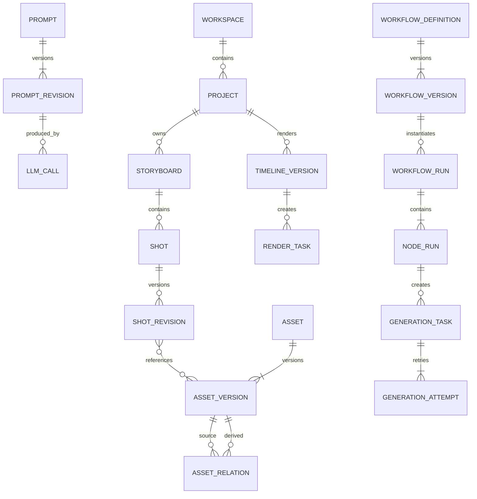
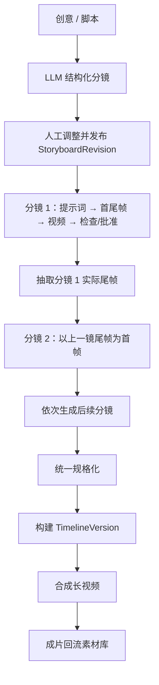

# Crevis 项目架构规格说明（拆分前归档）

> 本文件是 2026-07-05 模块化拆分前的只读快照。当前主文档见 [../architecture.md](../architecture.md)，各模块文档见本目录的 `01`—`09` 文件。

> 状态：Draft for implementation
>
> 版本：v1.0
>
> 更新日期：2026-07-05
>
> 依据：`specs/framework/spec.md`、`specs/workflow-v1/spec.md`、现有 Python 实现及业界公开方案

## 1. 文档目的

本文定义 Crevis 从“单次视频生成 CLI”演进为“可持续生产长视频的 AI 视频工作台”的目标架构。系统需要统一管理图片、视频、声音、人物、场景等素材，记录每一次提示词处理和模型任务，通过可恢复的工作流连续生成分镜短视频，最终合成长视频。

本文是后续数据模型、API、Worker、前端和迁移任务的设计基线。它描述系统边界、核心实体、模块职责、工作流语义、关键流程、接口约定和分阶段实施方案，不替代具体供应商 API 文档。

## 2. 目标与非目标

### 2.1 目标

1. 素材统一入库：支持本地上传、远程 URL、生成结果回流和派生素材，能按人物、声音、场景、道具、项目等维度复用。
2. 全链路留痕：记录原始提示词、优化过程、模型参数、供应商任务、输入输出、人工修改、费用和错误。
3. 模型解耦：以适配器调用大语言模型、图像模型、视频模型和音频模型；Seedance 2.0 是首个视频供应商，不是领域模型的一部分。
4. 工作流可恢复：服务或 Worker 重启后可继续执行，节点支持超时、重试、取消、人工确认和从失败节点续跑。
5. 分镜连续生成：每个分镜先确定首尾帧；相邻分镜通过显式连续性约束连接，默认将上一镜尾帧作为下一镜首帧。
6. 长视频合成：短视频在统一规格化后按时间线拼接，支持转场、字幕、旁白、音乐和多版本导出。
7. 渐进式落地：复用 `workflow-v1` 的提交、轮询、下载经验，避免一次性拆成大量微服务。

### 2.2 非目标

1. 第一阶段不实现通用低代码工作流产品，只实现 Crevis 所需的受控节点类型和 DAG 编辑能力。
2. 第一阶段不训练或托管基础生成模型，只调用外部 API 或本地推理适配器。
3. 第一阶段不实现专业 NLE 的全部能力；时间线聚焦分镜顺序、转场、字幕、音频和导出。
4. 不保证仅靠生成模型获得绝对人物一致性；系统负责固定参考资产、提示词和帧间依赖，并提供检查与重生成闭环。

## 3. 现状分析

### 3.1 已有能力

当前仓库存在两条并行链路：

- `video_generator.py + config_loader.py`：YAML 驱动、浏览器预览、后台线程提交和轮询的旧链路。
- `main.py + workflow-v1 模块`：CLI 驱动的输入管理、任务提交、轮询、下载和 JSONL 历史记录链路。

`workflow-v1` 已经形成最小闭环：

```text
收集输入 → 生成版本号 → 远程化 → 构建请求 → 提交供应商任务
       → 持久化任务 → 轮询状态 → 下载结果
```

这些模块可以成为新架构的适配层原型，但不能直接承担多用户、并发工作流和长视频生产。

### 3.2 与目标架构的主要差距

| 现状 | 风险 | 目标处理方式 |
|---|---|---|
| `RemoteUploader` 只拼接 URL，没有实际上传 | API 收到不可访问的伪 URL | 对象存储适配器执行真实上传，成功后才发布 `AssetVersion` |
| URL 在部分路径中先被转为 `Path` | `https://` 可能变成 `https:/`，远程输入识别失效 | API 层使用明确的 `source_type` 和 URL 类型，不用 `Path` 表示 URL |
| 版本号精确到秒 | 并发提交可能冲突 | 全部主键使用 UUIDv7/ULID；版本号只作展示字段 |
| 防重复标志只存在进程内存 | 重启或多进程下失效 | 数据库唯一约束和持久化幂等键 |
| JSONL 更新需要整文件重写 | 并发写入、崩溃恢复和查询能力不足 | PostgreSQL 保存当前态，事件表保存变更历史 |
| 监听依赖 CLI 守护线程 | CLI 退出后监听停止 | 独立 Worker、租约和定时调度 |
| 提交器直接依赖 Ark SDK | 无法切换模型或供应商 | `VideoProvider` 能力接口与供应商适配器 |
| 任务模型只覆盖单次生成 | 无法表达项目、分镜、节点、尝试和合成 | 引入 Project、Shot、WorkflowRun、NodeRun、GenerationTask、RenderTask |
| 提示词只存最终文本 | 无法复盘优化过程 | Prompt 与 PromptRevision 保存完整谱系 |
| 旧链路与新 CLI 并存 | 配置和状态语义分裂 | 统一应用服务，CLI 与 Web 共用 API/Service 层 |

### 3.3 可直接复用与需要替换的部分

| 当前模块 | 处理策略 |
|---|---|
| `ConfigManager` | 保留配置入口概念，改为环境变量/配置文件/密钥服务分层；配置不存业务数据 |
| `InputManager` | 演进为 `AssetService`，增加校验、真实上传、哈希、元数据和版本 |
| `RemoteUploader` | 替换为 `ObjectStorageAdapter`；URL 映射不等于上传 |
| `TaskSubmitter` | 拆为 `GenerationService` 与 `VideoProviderAdapter` |
| `TaskListener` | 演进为持久化的 `ProviderTaskWorker`，支持 webhook 优先、轮询兜底 |
| `OutputManager` | 演进为派生素材入库与 `RenderService` |
| `Storage` | JSONL 仅保留为导入/导出格式，在线状态迁到 PostgreSQL |
| `PreviewGenerator` | 交互思想保留，前端改为项目、素材、分镜、运行、时间线五个工作区 |

## 4. 业界方案分析与架构启示

以下结论基于 2026-07-05 可访问的官方文档：

| 方案 | 可借鉴模式 | Crevis 取舍 |
|---|---|---|
| ComfyUI | 工作流是节点和连接组成的图；工作流可保存为独立 JSON 并版本化，生成媒体也可携带工作流元数据。[官方文档](https://docs.comfy.org/development/core-concepts/workflow) | 采用版本化 DAG 和显式节点输入输出，但首版只开放受控节点集合，避免任意代码节点带来的安全与兼容成本 |
| AWS Step Functions | 编排状态与业务实现分离；保留运行状态、输入输出和执行历史；原生支持并行、超时、重试和异常分支。[官方文档](https://aws.amazon.com/documentation-overview/step-functions/) | 节点运行和领域任务分表，工作流执行保留事件历史；在当前规模先自建轻量持久化编排，达到阈值后可迁移托管/Temporal 引擎 |
| Temporal | 工作流状态持久化，外部 API 等副作用作为可重试 Activity 运行。[官方说明](https://temporal.io/) | 所有外部副作用都放在 Worker Activity 中，并要求幂等；首版不强依赖 Temporal，避免基础设施超配 |
| Runway API | 生成 API 采用异步任务；同时提供任务管理、上传、工作流和多镜头等独立能力。[官方 API](https://docs.dev.runwayml.com/api/) | 将“模型调用”“供应商任务”“工作流节点”建模为不同实体，避免把供应商 task id 当作系统任务主键 |
| Shotstack | 使用 JSON 时间线描述图片、视频、标题、音频、动画和转场，再异步渲染。[官方文档](https://shotstack.io/docs/guide/) | 长视频合成采用可版本化的 Timeline JSON，不把 FFmpeg 命令本身当业务数据 |
| FFmpeg | `concat` 可顺序拼接媒体；无转码拼接要求输入兼容，复杂转场则使用滤镜并重新编码。[官方格式文档](https://ffmpeg.org/ffmpeg-formats.html) | 合成前必须将片段规格化；无转场时允许快速拼接，有转场/字幕/混音时走统一重编码管线 |
| OpenCode CLI | `opencode run` 支持程序化执行一次性提示词。[官方 CLI 文档](https://dev.opencode.ai/docs/cli/) | 提供 `OpenCodeCliLLMAdapter` 供本地/单机使用；生产环境优先直接 API 适配器，以获得结构化响应、配额、超时和费用控制 |

核心结论是：生成媒体系统不应把“请求模型”视为唯一主流程。可靠实现需要把不可变素材、版本化图定义、持久化运行状态、异步供应商任务和时间线渲染分别建模，再由工作流连接。

## 5. 架构决策

### 5.1 部署形态

首个可生产版本采用“模块化单体 API + 多类独立 Worker”，共享 PostgreSQL、对象存储和消息队列：

```mermaid
flowchart LR
    UI["Web UI / CLI"] --> API["Crevis API"]
    API --> DB[("PostgreSQL")]
    API --> OBJ[("Object Storage")]
    API --> Q["Job Queue"]

    Q --> OW["Workflow Worker"]
    Q --> PW["Prompt Worker"]
    Q --> GW["Generation Worker"]
    Q --> MW["Media / Render Worker"]

    OW --> DB
    PW --> LLM["LLM Providers / OpenCode"]
    GW --> VM["Video / Image / Audio Providers"]
    MW --> FFMPEG["FFmpeg / ffprobe"]

    PW --> DB
    GW --> DB
    MW --> DB
    PW --> OBJ
    GW --> OBJ
    MW --> OBJ
```



这样既能独立扩展等待网络 API 的 Worker 和消耗 CPU/GPU 的媒体 Worker，又保留单仓库、单语言和事务边界。只有当团队规模、吞吐或隔离要求明确增长时，再拆分服务。

### 5.2 推荐技术基线

| 类别 | 首选 | 说明 |
|---|---|---|
| 语言 | Python 3.12 | 与现有项目一致 |
| HTTP API | FastAPI + Pydantic | OpenAPI、流式事件和结构化校验 |
| 主数据库 | PostgreSQL | 事务、JSONB、唯一约束、行锁和查询能力 |
| 对象存储 | S3 兼容接口；本地 MinIO | 原始和派生媒体统一存储 |
| 队列 | Redis + 支持延迟任务/重试的 Worker 库 | MVP 足够；业务正确性不得只依赖 Redis |
| 媒体处理 | FFmpeg + ffprobe | 规格化、抽帧、转场、字幕、混音、合成 |
| 工作流定义 | JSON Schema 校验的 DAG JSON | 定义不可变版本；运行时另存状态 |
| 前端 | 现有技术栈可选；通过 REST + SSE/WebSocket 接入 | 本 spec 不绑定具体框架 |

队列是唤醒机制，PostgreSQL 才是工作流真相源。即使消息丢失，调度器也能扫描可运行节点重新入队。

### 5.3 一致性原则

1. 媒体二进制只放对象存储，数据库保存引用、元数据和校验和。
2. 工作流定义不可变；编辑产生新版本，正在运行的实例继续绑定旧版本。
3. 节点至少执行一次，因此所有外部副作用必须幂等。
4. 供应商状态与系统状态分离，供应商成功不等于结果已入库。
5. 对用户可见的“完成”表示所有必需输出已校验并持久化，而不只是 API 返回成功。
6. 原始素材不被覆盖；裁剪、抽帧、转码和生成结果都创建新的 `AssetVersion`。

## 6. 领域模型

### 6.1 总体关系



### 6.2 项目与分镜

#### Project

| 字段 | 说明 |
|---|---|
| `id` | UUIDv7/ULID |
| `workspace_id` | 所属空间 |
| `name`, `description` | 项目信息 |
| `target_ratio`, `resolution`, `fps` | 项目统一输出规格 |
| `style_bible` | 色彩、摄影、角色、禁用元素等结构化约束 |
| `status` | `draft/active/archived` |

#### Storyboard

一个项目可以有多个分镜脚本版本。发布后用于创建工作流运行。

#### Shot

分镜的稳定身份，保存 `storyboard_id`、顺序、逻辑名称和当前修订版。排序使用可插入的 `sort_key`，而不是连续整数主键。

#### ShotRevision

保存每次分镜编辑的快照：

- 画面描述、动作、镜头语言、对白、时长、节奏；
- 人物、声音、场景、道具引用；
- 原始提示词与已批准提示词修订版；
- 首帧、目标尾帧、生成片段、实际尾帧；
- 连续性约束和质量检查结果；
- `supersedes_id`、创建者和创建时间。

已被工作流运行引用的修订版不允许原地修改。

### 6.3 素材模型

#### Asset

表示用户理解的逻辑素材，如“主角小蓝”“咖啡馆夜景”“旁白声音 A”。核心字段：

- `kind`: `image/video/audio/document/font/subtitle`；
- `category`: `character/voice/scene/prop/music/reference/generated/other`；
- `name`、`description`、标签、授权和来源信息；
- 所属工作区、创建者、归档状态。

人物库、声音库和场景库是带结构化 profile 的 Asset 集合，而不是三套独立文件系统：

- `CharacterProfile`：外观锚点、服装、负面约束、参考图版本；
- `VoiceProfile`：说话人、语言、风格、授权范围、参考音频版本；
- `SceneProfile`：地点、时段、光线、色板、空间关系、参考图/视频版本。

#### AssetVersion

表示不可变的具体文件：

| 字段 | 说明 |
|---|---|
| `id`, `asset_id`, `version_no` | 版本身份 |
| `object_key`, `storage_provider` | 对象存储定位；数据库不长期保存临时签名 URL |
| `sha256`, `size_bytes`, `mime_type` | 去重与完整性 |
| `width`, `height`, `duration_ms`, `fps`, `codec` | ffprobe/解析后的媒体元数据 |
| `source_type` | `upload/url_import/provider_output/derived` |
| `status` | `uploading/processing/ready/quarantined/failed/deleted` |
| `metadata` | 供应商响应、色彩空间等扩展字段 |

对象键建议：

```text
workspaces/{workspace_id}/assets/{asset_id}/versions/{version_id}/original.{ext}
workspaces/{workspace_id}/assets/{asset_id}/versions/{version_id}/derived/{purpose}.{ext}
```

#### AssetRelation

记录派生关系，例如：

- 视频 `extract_last_frame` 图片；
- 图片 `generate_video` 视频；
- 多个片段 `compose` 成长视频；
- 原视频 `normalize` 为统一规格视频。

关系必须包含产生它的 `node_run_id` 或人工操作记录，由此可以从成片反向追溯到每个输入。

### 6.4 提示词与模型调用

#### Prompt / PromptRevision

`Prompt` 是逻辑提示词，`PromptRevision` 是不可变快照，保存：

- `purpose`: `storyboard/shot/keyframe/video/quality_check`；
- 用户原文、模板 ID/版本、系统指令；
- 渲染后的完整提示词与结构化输入摘要；
- LLM 优化结果和用户最终编辑；
- 输入上下文哈希、语言和修订关系。

#### LLMCall

每次调用保存：供应商、模型、请求参数、输入/输出摘要、原始响应对象键、token 用量、费用、耗时、状态、错误和 trace id。密钥及敏感认证头永不持久化。

LLM 优化输出应遵守 JSON Schema，例如：

```json
{
  "optimized_prompt": "...",
  "negative_prompt": "...",
  "continuity": {
    "characters": ["character_asset_id"],
    "scene": "scene_asset_id",
    "camera": "medium tracking shot",
    "must_preserve": ["blue coat", "warm backlight"]
  },
  "generation": {
    "duration_seconds": 5,
    "ratio": "16:9"
  },
  "warnings": []
}
```

不要再从自然语言正则推断时长作为唯一来源。结构化字段优先，文本解析只用于兼容旧请求。

### 6.5 工作流与任务

#### WorkflowDefinition / WorkflowVersion

Definition 保存逻辑名称；Version 保存不可变 DAG JSON、输入输出 schema、节点版本和发布状态。

#### WorkflowRun

一次工作流执行，绑定项目、分镜脚本版本和工作流版本。状态：

```text
draft → queued → running ⇄ waiting_input
                         ⇄ paused
       → succeeded | failed | cancelled
```

#### NodeRun

一个节点的一次逻辑执行，状态：

```text
blocked → ready → queued → running
                         ├→ waiting_external → running
                         ├→ waiting_input → running
                         ├→ retry_scheduled → queued
                         └→ succeeded | failed | cancelled | skipped
```

关键字段包括 `input_refs`、`output_refs`、`attempt_count`、`available_at`、`lease_owner`、`lease_expires_at`、`heartbeat_at`、`error_code` 和 `error_detail`。

#### GenerationTask / GenerationAttempt

`GenerationTask` 表示 Crevis 的逻辑生成任务；`GenerationAttempt` 表示向供应商的一次实际提交。一次逻辑任务可因临时错误、切换供应商或人工重生成产生多个 attempt。

供应商 task id 只在 `(provider, provider_task_id)` 范围内唯一。

## 7. 模块划分与职责

### 7.1 API 与身份模块

- 身份认证、Workspace/Project 访问控制；
- 请求 schema 校验和幂等键处理；
- 生成素材上传签名 URL；
- REST API、SSE/WebSocket 状态事件；
- 不在请求线程中等待生成或渲染完成。

### 7.2 素材模块

- 初始化上传、完成上传、远程 URL 导入；
- MIME/魔数、大小、分辨率、时长和恶意文件校验；
- SHA-256 去重与原始文件不可变存储；
- ffprobe 元数据、缩略图、波形、代理视频和抽帧；
- 人物/声音/场景 profile、标签、搜索、引用关系；
- 生成结果和派生结果回流素材库。

远程 URL 导入必须防 SSRF：只允许 HTTP(S)，阻止回环、链路本地和私网地址，限制重定向、大小、超时和 Content-Type。

### 7.3 项目与分镜模块

- 管理项目风格圣经和输出规格；
- 从用户脚本或 LLM 结构化结果创建分镜；
- 分镜排序、修订、锁定、批准和批量操作；
- 计算上下游依赖和变更影响范围；
- 提供分镜卡片、首尾帧和候选视频的审核接口。

### 7.4 提示词模块

- 模板渲染、上下文拼装、优化、Schema 校验和修复；
- 将项目风格、人物 profile、场景 profile、前一镜摘要和连续性约束注入提示词；
- 保存原文、优化结果和人工编辑，不覆盖历史；
- 对相同模板版本、上下文哈希和模型参数支持可选缓存；
- 提供直接 API 与 OpenCode CLI 两类适配器。

`OpenCodeCliLLMAdapter` 必须用参数数组启动子进程，不做 shell 字符串拼接；设置工作目录、模型白名单、权限、超时、最大输出和并发上限。CLI 会话数据作为执行附件保存，不能替代系统任务记录。

### 7.5 模型网关

统一能力接口：

```python
class VideoProvider(Protocol):
    def capabilities(self) -> ProviderCapabilities: ...
    def submit(self, request: VideoGenerationRequest, idempotency_key: str) -> ProviderReceipt: ...
    def get(self, provider_task_id: str) -> ProviderTaskSnapshot: ...
    def cancel(self, provider_task_id: str) -> None: ...
    def parse_webhook(self, headers: dict, body: bytes) -> ProviderEvent: ...
```

同理定义 `LLMProvider`、`ImageProvider`、`AudioProvider`。内部请求模型不能暴露 Ark/Runway 等供应商字段，适配器负责：

- 能力校验和参数映射；
- 鉴权、限流、超时、重试分类；
- 供应商状态归一化；
- webhook 验签或轮询；
- 结果下载和原始响应留档；
- token/点数/预估费用记录。

维护能力矩阵，例如首帧、尾帧、参考图、参考视频、参考音频、时长、比例、并发和 webhook。工作流发布前据此验证，避免运行到中途才发现模型不支持。

### 7.6 工作流编排模块

- 校验 DAG 无环、端口类型匹配和必需参数；
- 解析依赖，将可运行节点置为 `ready`；
- 通过事务 Outbox 发布任务；
- Worker 使用租约领取节点并定期 heartbeat；
- 对失效租约重新调度；
- 处理重试、取消、暂停、人工确认、跳过和从节点续跑；
- 记录状态事件，向前端推送进度；
- 定期 reconciliation，修复“数据库已提交但消息未发布”等中间状态。

首版可用 PostgreSQL + 队列实现。满足以下任一条件时评估迁移 Temporal/托管编排：跨服务工作流显著增加、运行超过数日、补偿逻辑复杂、月执行节点达到当前实现维护瓶颈，或需要多集群灾备。

### 7.7 媒体与合成模块

- 用 ffprobe 校验片段；
- 规格化分辨率、比例、帧率、像素格式、视频/音频编码、采样率和声道；
- 抽取首帧/尾帧和联系表；
- 根据 Timeline JSON 生成确定性的 FFmpeg 执行计划；
- 支持硬切、转场、字幕、旁白、背景音乐、响度标准化和封面；
- 导出 MP4 及必要的代理版本；
- 保存 FFmpeg 版本、命令摘要、日志对象键和输入输出校验和。

### 7.8 任务与审计模块

统一查询 LLM、图像、视频、媒体处理和渲染任务，展示：

- 项目/分镜/节点上下文；
- 当前状态、进度、等待原因和重试次数；
- 原始提示词、最终提示词、模型参数；
- 输入输出素材；
- 供应商任务与每次尝试；
- 耗时、费用、错误和操作者；
- 完整状态事件与审计事件。

## 8. 工作流定义

### 8.1 节点契约

每个节点类型必须声明：

- `type` 和语义版本；
- 输入/输出端口及 JSON Schema；
- 配置 schema 和默认值；
- 是否有外部副作用；
- 超时、最大重试次数和退避策略；
- 可重试错误集合；
- 幂等键生成规则；
- 所需 Worker 能力和资源类别；
- 取消与补偿能力。

节点只在 `output_refs` 中返回资源 ID/对象键和小型结构化数据，不在数据库行或队列消息中传递媒体二进制。

### 8.2 首批节点类型

| 节点 | 作用 |
|---|---|
| `asset.import` | 上传或导入输入素材 |
| `llm.storyboard` | 将创意/脚本拆为结构化分镜 |
| `llm.prompt.optimize` | 优化某分镜提示词并保留谱系 |
| `image.keyframe.start` | 生成或选定首帧 |
| `image.keyframe.end` | 生成目标尾帧 |
| `video.generate` | 使用提示词、首尾帧和参考素材生成短视频 |
| `video.extract_frame` | 从实际片段抽取首/尾帧 |
| `quality.inspect` | 检查技术规格和可选视觉/连续性规则 |
| `human.approval` | 等待用户批准、选择候选或要求重生成 |
| `video.normalize` | 统一片段编码规格 |
| `timeline.compose` | 从已批准片段构建 Timeline JSON |
| `video.render` | 执行合成并回流素材库 |
| `notify` | 发送站内事件或外部通知 |

### 8.3 示例工作流定义

```json
{
  "schema_version": "1.0",
  "name": "storyboard-to-long-video",
  "inputs": {
    "project_id": {"type": "string"},
    "storyboard_revision_id": {"type": "string"}
  },
  "nodes": [
    {"id": "plan", "type": "llm.storyboard@1", "config": {}},
    {"id": "shots", "type": "shot.sequence@1", "config": {"mode": "sequential"}},
    {"id": "compose", "type": "timeline.compose@1", "config": {}},
    {"id": "render", "type": "video.render@1", "config": {"preset": "project"}}
  ],
  "edges": [
    {"from": "plan.storyboard", "to": "shots.storyboard"},
    {"from": "shots.approved_clips", "to": "compose.clips"},
    {"from": "compose.timeline", "to": "render.timeline"}
  ]
}
```

`shot.sequence` 是复合节点；其内部对子分镜执行提示词、关键帧、视频、检查和审批节点。工作流存储时保留复合节点，运行时展开为可观测的子节点。

## 9. 核心业务流程

### 9.1 素材入库

```text
1. 客户端创建 Asset，并声明素材类别和预期媒体类型
2. API 返回短期上传签名 URL 和 asset_version_id
3. 客户端直传对象存储
4. 客户端确认上传；API 校验对象存在、大小和校验和
5. 媒体 Worker 校验 MIME、探测元数据并生成缩略图/代理
6. AssetVersion 变为 ready，才允许工作流引用
```

URL 导入由 Worker 下载到受控临时区并重新上传对象存储，不能长期把第三方 URL 当唯一资产地址。

### 9.2 单次视频生成

该流程兼容 `workflow-v1`，但将步骤持久化：

```text
创建 GenerationTask
  → 校验并解析 AssetVersion
  → 生成供应商可访问的短期 URL
  → 记录 GenerationAttempt
  → 通过 VideoProvider.submit 提交
  → webhook 或轮询同步状态
  → 下载到受控临时文件并校验
  → 上传对象存储，创建生成结果 AssetVersion
  → GenerationTask succeeded
```

如果供应商返回成功而结果下载失败，状态应为 `result_pending`/节点 `retry_scheduled`，不能回退为重新提交生成，以免重复计费。

### 9.3 从脚本持续生成长视频



每个分镜的详细步骤：

1. 加载当前 `ShotRevision`、项目风格圣经、人物/场景/声音 profile。
2. 确定首帧：第一镜由用户选择或模型生成；后续镜默认引用上一镜已批准视频的实际尾帧。
3. 生成目标尾帧：结合首帧、镜头动作、下一个分镜目标和人物/场景约束生成；如果模型原生支持尾帧条件则直接传入，否则作为规划参考和质检目标。
4. LLM 输出结构化优化提示词，用户可在运行前或审批节点修改。
5. 提交一个或多个视频候选；记录每个候选的完整输入、模型和费用。
6. 对结果做技术检查：文件可读、时长、分辨率、帧率、黑帧/静音等。
7. 可选做语义检查：人物、服装、场景、主体和尾帧相似度；自动检查只提供分数和警告，不冒充绝对质量判断。
8. 人工批准一个候选，或修改提示词/关键帧后重生成。
9. 从已批准视频抽取实际尾帧，作为不可变派生素材写入下一镜依赖。

### 9.4 连续性规则

1. 硬约束：相邻分镜的边界由 `ContinuityLink` 明确记录，包含上游实际尾帧和下游首帧引用。
2. 软约束：人物参考、服装、场景、光线、色板、镜头方向和运动趋势写入结构化 continuity context。
3. 默认串行：只有当前镜已批准并产出实际尾帧，下一镜才可运行。
4. 可选并行：当用户预先锁定所有边界关键帧时，片段可以并行生成；否则并行会削弱连续性。
5. 下游失效：若重新批准了某镜的新视频，其实际尾帧变化，则后续依赖节点标记为 `stale`。系统展示影响范围，由用户选择“保留现有下游”或“从下一镜重跑”，不静默删除结果。
6. 转场不是连续性的替代品：硬切要求边界更严格；溶解等转场可缓解微小差异，但仍需保存真实边界资产。

### 9.5 长视频合成

1. 收集所有已批准片段，生成不可变 `TimelineVersion`。
2. 媒体 Worker 先规格化每段视频，原文件保持不变。
3. 没有转场且流参数完全一致时，可使用 concat 快速拼接。
4. 有转场、裁剪、字幕或混音时，生成 filter graph 并统一重编码。
5. 旁白、对白、音乐分别建轨，使用项目级音量/ducking/响度策略。
6. 成片通过 ffprobe 和最小播放校验后上传对象存储，创建 Asset/AssetVersion 和所有 `composed_from` 关系。
7. 任意素材、片段或时间线修改都会创建新 RenderTask，不覆盖旧成片。

## 10. 可靠性与执行语义

### 10.1 幂等

客户端创建型 API 接收 `Idempotency-Key`。节点副作用幂等键建议为：

```text
sha256(workflow_run_id + node_run_id + logical_operation + input_fingerprint)
```

同一逻辑尝试重试时键保持稳定；用户主动“生成新候选”创建新的逻辑任务和幂等键。

数据库约束至少包括：

- `(workspace_id, idempotency_key)` 唯一；
- `(provider, provider_task_id)` 唯一；
- `(workflow_run_id, expanded_node_key)` 唯一；
- `(asset_id, version_no)` 唯一；
- 同一运行中只能有一个活动的相同逻辑渲染任务。

### 10.2 事务 Outbox

业务状态更新和 outbox 事件在同一数据库事务写入。发布器把未发布事件送入队列并标记时间；重复投递由 Worker 幂等消费。禁止“先提交数据库，再直接发消息”这种会产生丢任务窗口的做法。

### 10.3 租约与恢复

- Worker 领取节点时写入 `lease_owner` 和 `lease_expires_at`；
- 长任务定期 heartbeat；
- 调度器回收过期租约并按错误类型重试；
- 外部异步任务的 lease 只覆盖一次查询/处理，不应在数分钟生成期间长期占用 Worker；
- 重启后根据数据库状态恢复，不依赖线程内对象。

### 10.4 重试分类

| 类型 | 示例 | 策略 |
|---|---|---|
| 临时错误 | 429、5xx、网络超时 | 指数退避 + jitter，遵守 `Retry-After` |
| 供应商异步等待 | pending/running | 延迟调度，不计作失败重试 |
| 永久输入错误 | 参数无效、素材格式不支持 | 立即失败，等待用户修正 |
| 认证/配额错误 | key 无效、余额不足 | 暂停相关供应商队列并告警 |
| 结果搬运错误 | 下载失败、对象存储超时 | 只重试结果搬运，不重新生成 |
| 质量不达标 | 连续性分数低、人工拒绝 | 产生新候选任务，不算基础设施重试 |

### 10.5 webhook 与轮询

供应商支持 webhook 时优先 webhook，并验证签名、时间戳和重放；轮询作为丢回调兜底。轮询间隔使用退避和随机抖动，不再为所有任务固定 30 秒。终态到达后仍需幂等处理重复事件。

## 11. API 边界

首版建议资源接口：

```text
POST   /api/v1/assets
POST   /api/v1/assets/{id}/versions:begin-upload
POST   /api/v1/assets/{id}/versions/{version_id}:complete-upload
POST   /api/v1/assets:import-url
GET    /api/v1/assets
GET    /api/v1/assets/{id}

POST   /api/v1/projects
GET    /api/v1/projects/{id}
POST   /api/v1/projects/{id}/storyboards
POST   /api/v1/storyboards/{id}/revisions
POST   /api/v1/storyboard-revisions/{id}:publish
POST   /api/v1/shots/{id}/revisions

POST   /api/v1/prompts/{id}:optimize
GET    /api/v1/prompts/{id}/revisions

POST   /api/v1/workflow-definitions
POST   /api/v1/workflow-definitions/{id}/versions
POST   /api/v1/workflow-runs
GET    /api/v1/workflow-runs/{id}
POST   /api/v1/workflow-runs/{id}:pause
POST   /api/v1/workflow-runs/{id}:resume
POST   /api/v1/workflow-runs/{id}:cancel
POST   /api/v1/node-runs/{id}:retry
POST   /api/v1/node-runs/{id}:approve
POST   /api/v1/node-runs/{id}:reject

POST   /api/v1/timelines
POST   /api/v1/timeline-versions/{id}:render
GET    /api/v1/tasks
GET    /api/v1/events/stream
```

约定：

- 创建/副作用接口接受 `Idempotency-Key`；
- 所有响应包含系统 ID，不暴露本地绝对路径；
- 大列表使用游标分页；
- 错误使用稳定 `error_code` 与可读 message；
- API Key 只在服务端引用 credential id，不在任务请求/响应中返回；
- 下载通过短期签名 URL，业务记录保存 object key。

## 12. Timeline JSON

Timeline 是业务层合成描述，示例：

```json
{
  "schema_version": "1.0",
  "canvas": {"width": 1920, "height": 1080, "fps": 24},
  "tracks": [
    {
      "type": "video",
      "clips": [
        {
          "asset_version_id": "av_01",
          "start_ms": 0,
          "in_ms": 0,
          "duration_ms": 5000,
          "transition_out": {"type": "dissolve", "duration_ms": 300}
        },
        {
          "asset_version_id": "av_02",
          "start_ms": 4700,
          "in_ms": 0,
          "duration_ms": 5000
        }
      ]
    },
    {"type": "subtitle", "clips": []},
    {"type": "voice", "clips": []},
    {"type": "music", "clips": []}
  ],
  "output": {"container": "mp4", "video_codec": "h264", "audio_codec": "aac"}
}
```

Timeline Schema 必须版本化，并在渲染前校验重叠、越界、缺失资产和不支持的效果。

## 13. 前端信息架构

### 13.1 项目工作台

- 项目概况、目标规格、风格圣经；
- 最近工作流、费用、失败和待审核事项；
- 从脚本创建分镜的入口。

### 13.2 素材库

- 网格/列表、标签和人物/声音/场景筛选；
- 上传、URL 导入、版本、来源和派生关系；
- 预览图、视频代理和音频波形；
- 显示素材被哪些项目/分镜引用，避免误删。

### 13.3 分镜板

- 每个 Shot 卡片显示首帧、尾帧、候选片段、时长和状态；
- 拖拽排序、批量锁定、提示词编辑；
- 直观看到相邻分镜的 ContinuityLink；
- 上游变更时标记受影响的下游，而非自动覆盖。

### 13.4 工作流运行视图

- 图形化展示节点状态、重试和等待原因；
- 节点抽屉展示输入输出、提示词、供应商任务、日志和费用；
- 支持暂停、取消、重试、批准和从某节点创建新运行。

### 13.5 时间线与导出

- 按镜头查看片段顺序、转场、字幕和音轨；
- 轻量预览与低清代理；
- 渲染版本、参数、进度和成片下载。

## 14. 安全与治理

1. 供应商密钥由环境变量或密钥管理服务注入，数据库只保存 credential 引用和脱敏标识。
2. 日志、异常、审计和模型请求快照统一做密钥与敏感头脱敏。
3. Workspace 级 RBAC 至少包含 owner/editor/viewer；素材和任务查询必须带 workspace 条件。
4. 对象存储默认私有，签名 URL 短期有效；供应商必须长期访问时使用专用临时副本和生命周期清理。
5. 上传按魔数校验，不信任文件扩展名；限制大小、像素、时长和解压炸弹。
6. 记录人物肖像、声音和音乐的来源、授权范围、到期时间及使用审计。
7. 定义软删除与保留策略；仍被版本、运行或成片引用的 AssetVersion 不做物理删除。
8. LLM/模型输入遵守工作区数据策略，可配置不允许发送到特定供应商。

## 15. 可观测性与成本

每个用户请求、工作流、节点、供应商 attempt 和媒体任务携带关联 trace id。至少提供：

- 队列长度、等待时长、节点运行时长、成功率和重试率；
- 供应商提交/轮询延迟、429/5xx、回调延迟；
- 每模型调用次数、token/点数、估算和结算费用；
- 每项目、分镜、成功秒数的生成成本；
- 对象存储容量、临时文件和派生资产增长；
- FFmpeg 失败率、转码倍率和输出规格分布；
- 待人工审核时长和被拒候选率。

结构化日志只保存对象 ID 和摘要；大型供应商响应、FFmpeg 日志和 LLM 原始输出放对象存储并设置保留期。

## 16. 包结构建议

```text
crevis/
├── app/
│   ├── api/                    # FastAPI 路由、schema、鉴权
│   ├── domain/                 # 领域实体、状态机、策略；不依赖 SDK
│   │   ├── assets/
│   │   ├── projects/
│   │   ├── prompts/
│   │   ├── generations/
│   │   ├── workflows/
│   │   └── timelines/
│   ├── application/            # 用例与事务编排
│   ├── infrastructure/
│   │   ├── db/                 # ORM、repository、migration、outbox
│   │   ├── queue/
│   │   ├── storage/
│   │   ├── providers/
│   │   │   ├── llm/
│   │   │   ├── image/
│   │   │   ├── video/
│   │   │   └── audio/
│   │   └── media/              # ffmpeg/ffprobe
│   ├── workers/
│   └── settings.py
├── web/                        # 前端
├── tests/
│   ├── unit/
│   ├── integration/
│   ├── contract/               # 供应商适配器契约测试
│   └── e2e/
├── specs/
└── python/                     # 迁移期间的 legacy，最终删除
```

领域层不得 import Ark、Redis、ORM 或 FFmpeg 封装。供应商、存储和队列通过 Protocol/Port 注入。

## 17. 分阶段实施

### Phase 0：收敛现有链路

- 选定 `main.py` 链路为迁移入口，旧 `video_generator.py` 标记 legacy；
- 修复 URL 类型、真实上传、UUID 主键和配置警告语义；
- 为当前单任务流程补齐单元测试和供应商 mock；
- 明确 Seedance 当前可用参数和能力矩阵。

验收：单任务从上传到结果入库可重复执行；中途退出 CLI 不丢任务；历史中无明文密钥。

### Phase 1：素材与任务底座

- 引入 PostgreSQL migration、Asset/AssetVersion、GenerationTask/Attempt、事件表；
- 接入 S3/MinIO 真实上传、签名 URL、ffprobe 和缩略图；
- 把 Ark 调用封装为 `SeedanceVideoProvider`；
- 独立 Worker 完成提交、轮询/回调和结果搬运；
- 提供素材库、任务列表和单任务 Web API。

验收：服务和 Worker 任意重启后可恢复；重复请求不会重复提交或计费；结果能追溯到输入。

### Phase 2：项目、提示词与分镜

- 实现 Project、Storyboard/Revision、Shot/Revision、Prompt/Revision；
- 接入 LLM API 和可选 OpenCode CLI 适配器，使用结构化输出；
- 实现人物/声音/场景 profile；
- 前端提供项目工作台、素材库和分镜板。

验收：可以从脚本生成可编辑分镜；每个分镜保留原始、优化和人工提示词版本。

### Phase 3：持久化工作流与连续生成

- 实现 WorkflowDefinition/Version、Run、NodeRun、Outbox、租约和 reconciliation；
- 实现首尾帧、视频生成、抽帧、质检和人工批准节点；
- 实现 ContinuityLink、串行分镜执行、下游 stale 检测与选择性重跑；
- 提供工作流运行图和事件流。

验收：至少 5 个分镜可以跨服务重启持续生成；相邻分镜使用明确的实际尾帧/首帧关系；失败可从节点续跑。

### Phase 4：时间线与长视频导出

- 实现 Timeline Schema/Version、规格化和 FFmpeg 渲染；
- 支持硬切、基础转场、字幕、旁白和音乐；
- 成片及派生关系回流素材库；
- 增加成本、质量和性能指标。

验收：可将已批准分镜稳定导出长视频；任意输入版本可追溯；重复渲染同一时间线产生可核验结果。

### Phase 5：扩展与规模化

- 增加多供应商路由、配额、预算、优先级和降级策略；
- 允许锁定边界帧后的安全并行生成；
- 基于真实吞吐评估 Temporal/托管编排迁移；
- 增加团队协作、评论、审批策略和模板市场。

## 18. 测试策略

1. 单元测试：状态机、DAG 校验、幂等键、提示词 schema、连续性失效规则和时间线计算。
2. 集成测试：PostgreSQL 事务/Outbox、Redis 重复投递、MinIO 上传、ffprobe/FFmpeg。
3. 适配器契约测试：所有 VideoProvider 对同一归一化请求和状态集合表现一致。
4. 故障注入：提交超时但供应商已受理、重复 webhook、Worker 被杀、租约过期、下载中断、对象存储失败。
5. 端到端测试：3 个短分镜、一次拒绝重生成、服务重启、最终合成。
6. 媒体黄金样例：固定输入验证时长、分辨率、帧率、音轨、边界帧和 Timeline 计算；不强求有损编码文件字节完全一致。
7. 安全测试：SSRF、伪造 MIME、超大文件、越权素材引用、签名 URL 过期和日志密钥泄露。

## 19. 架构验收标准

目标架构实现完成时，应满足：

- 任意成片可追溯到 Timeline、所有分镜片段、关键帧、提示词修订、模型调用和原始素材；
- 任意运行中进程重启后能恢复，不依赖内存线程保存唯一状态；
- 同一幂等请求不会创建重复供应商任务；
- 供应商成功但下载失败时不会重新发起昂贵生成；
- 素材原文件不可变，全部处理结果以派生版本存在；
- 工作流定义和运行状态分离，旧运行不受定义编辑影响；
- 相邻分镜存在可查询的尾帧到首帧依赖；上游重生成会显式标记下游影响；
- 长视频在合成前经过统一规格化，渲染配置可版本化复现；
- 密钥不进入业务表、日志、任务快照和前端响应；
- CLI 与 Web 调用相同应用服务，不再维护两套生成逻辑。

## 20. 待确认事项

以下事项不阻塞底座实现，但应在对应 Phase 开始前确认：

1. 首批生产对象存储是火山 TOS、阿里 OSS 还是通用 S3；适配层仍使用 S3 风格领域接口。
2. Seedance 2.0 当前账号实际支持的首帧、尾帧、参考音频、时长和回调能力，以控制台/正式 API 合同测试为准。
3. 第一版前端是否需要多人 Workspace；即使单用户，也建议表结构保留 `workspace_id`。
4. LLM 生产调用优先直接 API 还是 OpenCode CLI；建议 CLI 仅用于本地和受控单机环境。
5. 质量检查首版只做技术检查，还是同时接入视觉模型做人物/场景连续性评分。
6. 成片是否需要商用响度、色彩空间、字幕格式和平台预设，这将决定 FFmpeg preset 的验收标准。

---

本方案的最小正确切入点不是先画一个无限自由的节点编辑器，而是先让“素材版本—任务尝试—分镜修订—节点运行—成片时间线”五条数据链闭合。数据谱系和恢复能力稳定后，工作流界面、多供应商和并行化才会成为可控增量。
